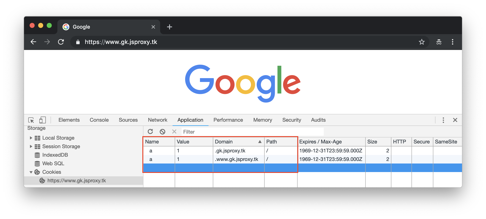
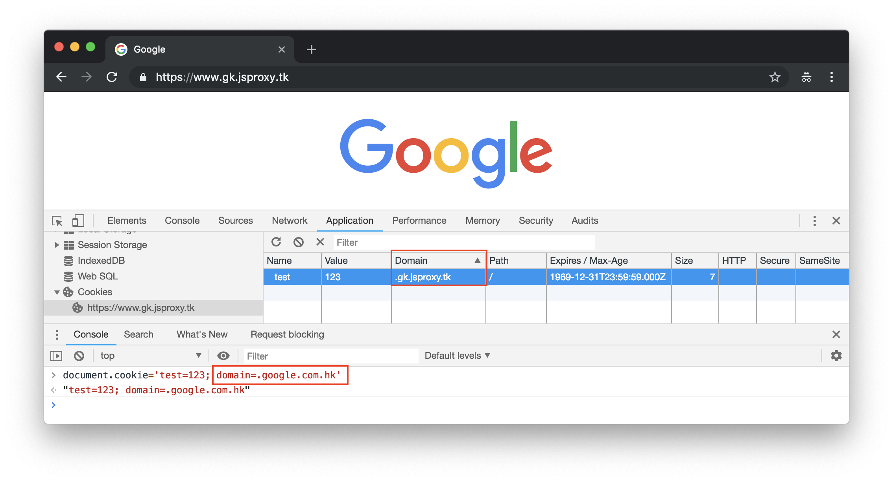
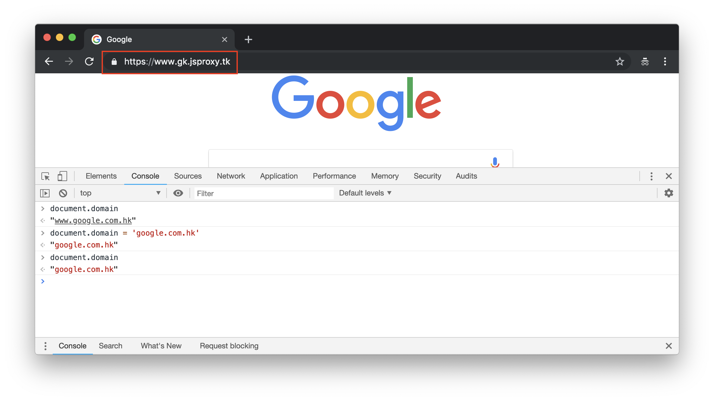
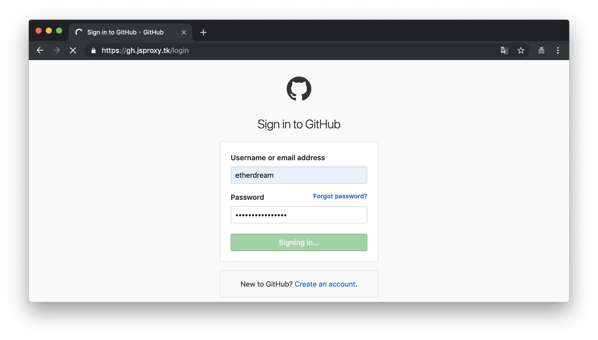
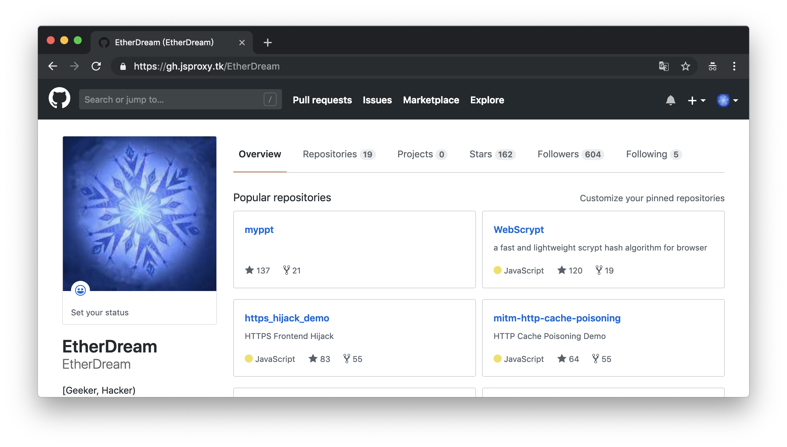

# 在线预览

https://www.gk.jsproxy.tk

（目前仍在更新中，最好使用隐身模式访问，避免缓存导致的问题）

# 安装部署

## 依赖

* OpenResty

* acme.sh

* node.js / webpack / webpack-cli

CentOS7 可执行 `./server/setup.sh` 一键安装。


## 配置

首先需要一个域名，例如 example.com，解析 @ 和 * 到服务器 IP。

在项目的根目录下新建 `dnsconf` 文件：

```bash
DOMAIN=example.com
DNS_ID=dns_xx
export xx_id=xxx
export xx_key=xxxxxx
```

第一个为域名，后面三个参考 [acme.sh dns api](https://github.com/Neilpang/acme.sh/tree/master/dnsapi)。

执行 `./build.sh`。该过程会申请 SSL 证书，时间可能较长。

执行 `./server/run.sh` 开启服务。

访问 `https://example.com` 即可进入首页。

> 本项目使用了 `brotli_static` 指令，如果当前的 nginx 不支持，可在 `server/nginx.conf` 配置中将其注释，或参考 `server/setup.sh` 重新编译 nginx。


## 扩展

编辑 `sitelist.txt` 文件，可配置站点别名，格式为 `别名 主机名`。配置完成后需要执行 `build.sh` 更新。

执行 `./server/run.sh reload` 重启服务。（该命令的参数和 nginx -s 意义一样，当然也可以自己管理 nginx 服务）

访问 `https://别名.example.com` 即可进入相应站点。

由于 HTTPS 证书不支持多级通配，所以别名数量是有限的（好像 acme.sh 只支持 30 几个）

对于普通的域名，例如 `www.host.com` 则转换成 `www-dot-host-dot-com.example.com` 的格式，即 `.` 变成 `-dot-`。（原本就有 `-dot-` 字符的域名暂未考虑）


# 功能特点

## 性能开销

本代理主要功能都运行在客户端，最大程度减少服务端计算量。前端通过 `Service Worker` 拦截和处理资源，同时注入一个 JS 到页面顶部，实现一些辅助功能。

服务端则非常简单，直接利用 nginx 反向代理功能，并且不修改内容（只修改 HTTP 头），避免处理内容的开销，以及原始数据解压再压缩的开销（或者不压缩时流量开销）。

例如现在流行的 br 压缩，压缩比高但压缩成本很大。因此让代理服务器只转发而不操作数据，可节省大量资源。


## 域名模型

本代理将不同的目标站点作为独立的子域名，例如：

```text
so.jsproxy.tk  =>  stackoverflow.com
gk.jsproxy.tk  =>  www.google.com.hk
```

这在一定程度上隔离了站点之间的数据，例如 Cookie、Storage 等。

该模型支持目标站点子域和主域 Cookie 共存：



另外页面中的辅助脚本，也会对部分 DOM API 进行重写，模拟一个沙盒环境。

例如脚本设置 Cookie 时，会触发钩子程序对赋值进行调整：



类似的还有：



使得代理对页面尽可能保持透明。


## 路径修正

前端脚本会对资源、超链接、表单、弹窗的 URL 进行修正。

后端代理会对请求头的 `Referer`、`Origin` 字段进行修正，减少被拦截的可能。





目前测试了 GitHub、Twitter 可以登陆，Google 登陆还有一些问题。

当然请不要在测试服务器里输入隐私数据。


# 存在问题

该代理目前仍存在较多问题，主要有：

## 普通域名模式没有子域

由于 `www-dot-host-dot-com.example.com` 并非 `host-dot-com.example.com` 的子域，因此这种模式下 cookie 和 domain 都无法支持域模型。

未来可能会尝试把所有站点都放在同个域名下，例如 `https://example.com/host.com/path/to`，这样就无需考虑域名的问题。当然这种方案需要重写更多的 API 以确保数据隔离，甚至还要自己维护 cookie 的携带，难度比较大。


## location hook

由于 `window` 和 `document` 对象的 `location` 属性无法重写，导致很多网站的脚本在读写路径时会出问题。

目前在代码层解决这个问题：通过 Service Worker 以及 API 钩子拦截 JS 代码，然后将其中的 `location` 字符串替换成 `__location`，从而将操作转到我们的对象上。

由于这种方式简单粗暴，有时会把正则、字符串、属性名的 location 也替换了，导致代码出现问题。因此之后会尝试在 AST 层面进行调整，当然缺点是比较耗时，尤其对于很大的 JS。

当然，如果 `location` 不是字面出现的，比如 `obj[key]` 形式，那么这种方案仍不可行，除非调整 `window` 和 `document`。但它们也可以不通过字面获取，例如通过 `this` 也可以获取 `window`，更别提 `eval` 等等。。。所以网站本身若真想访问 `location`，我们还是很难阻止的。

因此这里给 Web 开发者一个建议：如果想检测当前页面 URL 是否为钓鱼网站，最好不要出现字面量的 `window`、`location` 获取 URL，而是通过动态的方式进行获取，以防落入上述这种低级的陷阱。


## 多进程问题

由于 Service Worker 无法拦截第三方站点的框架页，因此会出现 iframe 逃脱代理的情况。

目前尝试对框架元素的 `src` 属性进行拦截，同时监控 DOM 创建事件，将新增的框架调整成我们的 URL。当然这里面还涉及到 `about:`、`blob:`、`data:` 等协议，会有些麻烦，暂未实现。

另外新创建的 `Worker`、`SharedWorker` 暂时也没有注入辅助 JS 代码，还在调研中。

至于业务方的 `ServiceWorker`，目前是直接拒绝其使用的，因为这会和代理本身的 `ServiceWorker` 冲突。以后再调研两者是否能较好的共存。


## 很多地方需要优化

由于目前还只是个概念验证的状态，很多代码都是临时写的，之后稳定了再重构和完善。

另外测试案例也没有，估计有一大堆 BUG 还没发现。


# 优化探索

YY 一些优化方案，以后有时间探索。

## 流量的优先级

因为我们是在前端拦截流量，所以能了解每个请求的具体用途，从而可更好的设置优先级。例如在流量压力较大时，优先满足网页、脚本等流量，推迟视频、动画等流量，确保主要功能不受影响。

## 脚本离线分析

由于前端修改 JS 比较耗性能，因此可事先把各大网站的常用脚本在本地分析，然后上传到 nginx 缓存里。这样浏览器就不需要实时计算了，可以大幅降低开销。并且离线分析可以更加深入，对于动态访问 `location` 的情况也能覆盖到，甚至完全不局限于修改 `location` 的功能，而是更通用的调整，例如去广告，增加其他功能等等。

另外对于常用的内联脚本，也可将离线分析结果进行下发，浏览器运行时只需简单查表，避免大量在线计算。

## 资源本地加速

进一步，还考虑可以把常用网站的静态资源预先下回本地，部署到附近的 CDN 上，或者 [打包成图片上传到各大免费图床、相册里](https://yq.aliyun.com/articles/236582)，提供给 Service Worker 更快的访问通道。这样可大幅加快网站访问速度，并且节省代理服务器的流量！

## 缓存重新压缩

虽然大部分网站都开启了 HTTP 传输压缩，并且不少支持 br 格式，但考虑到压缩成本，很多网站并没有将压缩率调到最大。而我们的代理服务器，显然也不会为了节省那么一点流量，牺牲大量 CPU 去做解压和压缩。

但是，这个过程可以离线去做，尤其对于那些 CPU 过剩而流量紧缺的服务器。我们可将空闲时的 CPU 资源用于 nginx cache 最高级 br 压缩。甚至还可以对非 CORS 请求的图片进行更高程度的压缩，并且转换成 WebP 格式，进一步降低流量开销。

## 动态数据压缩

有些网页内容很大却关闭了缓存，例如 google 首页，每次访问都要重新下载一次，浪费不少流量。但是让代理服务器强制缓存也是不行的，因为页面里可能包含了用户信息，缓存的话就会串号导致隐私问题。

然而这些页面的绝大部分都是相同的，每次重复传输实属不必。因此，我们可预先分析出那些不涉及隐私的公共子串，将其部署在本地 CDN 上。代理在返回数据时，重复部分用索引代替，从而可减少传输流量，提高访问速度。更进一步，甚至可以尝试把网页反推回模板，这样只需传输模板变量就可以！

对于那些流量接收免费、发送计费的服务器来说，这是个值得考虑的优化方案。


# 初衷

春节期间由于家里电脑上不了 google 很是不爽，平时用惯了公司自带的科学上网，好久没维护自己的都不能用了，于是一气之下写了这个程序。

其实很久以前也尝试过类似的，但都十分简陋。这次决定做个完善的，充分用上浏览器的新技术和黑魔法，顺便再熟悉下 nginx 的技术细节。

当然制作过程并不顺利，遇到各种问题。因此先实现了一个简单的 google 代理，之后的问题就可以通过它解决了。于是用「开发中的代理」搜索「代理开发中」遇到的问题，然后不断改进。或许这就叫自举😂

尽管折腾了整个春节，但毕竟不是寒假才几天时间，所以仍是个半成品。不过用来浏览常见的编程网站是没问题的，甚至还能刷推看视频。

当然要做到完善还需不少时间，暂时先分享个半成品吧~


# 后续

之后还会将它用于以下技术的研究：

* 网站镜像 / 沙盒化

* 钓鱼网站攻防检测

* 资源访问端上加速

当然请勿将本项目用于访问非法用途，否则后果自负。


# License

MIT