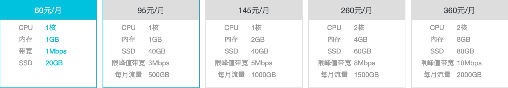
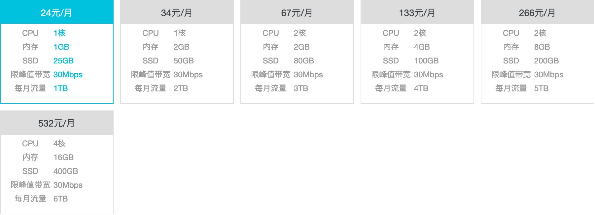

《玩转阿里轻量云》

# 为什么选择轻量云

没别的，流量便宜。

由于众所周知的原因，中国境内的服务器网络费用比境外贵上百倍。如今国外 VPS 带宽不少都是 Gbps 起步，而咱们几乎都是 1Mbps 起步，仍停留在蛮荒时代。相比硬件性能每年都在提升，带宽却龟然不动~ 按流量计费？那就更恐怖了，每 GB 几毛钱，对于大流量的应用简直就是噩梦。而对于小应用，有时遇到恶意耗流量的攻击，也可能一夜间欠下「巨款」。

好在去年阿里云推出了「轻量应用服务器」，尽管大陆区仍是 1Mbps 的小水管，但有了「香港」和「新加坡」两个地区可供选择 —— 不仅价格不到一半，带宽更是多了 30 倍！

## 华东1（杭州）



## 中国（香港）



对于国际套餐，这里简单列了一个表格（带宽都是 30Mbps）：

| 套餐 | 价格  | CPU | 内存  |  硬盘  | 流量 |  每天价格  | 每 TB 价格 |
|:---:|------:|-----|-----:|------:|----:|----------:|----------:|
|  A  |  ￥24 | 1 核 |  1GB |  25GB | 1TB | **￥0.77**|   ￥24.00 |
|  B  |  ￥34 | 1 核 |  2GB |  50GB | 2TB |    ￥1.10 |**￥17.00**|
|  C  |  ￥67 | 2 核 |  2GB |  80GB | 3TB |    ￥2.16 |   ￥22.30 |
|  D  | ￥133 | 2 核 |  4GB | 100GB | 4TB |    ￥4.29 |   ￥33.25 |
|  E  | ￥266 | 2 核 |  8GB | 200GB | 5TB |    ￥8.58 |   ￥53.20 |
|  F  | ￥532 | 4 核 | 16GB | 400GB | 6TB |   ￥17.16 |   ￥88.67 |

> 这是在写本文时（2019-09-19）的数据，和去年推出时似乎没有变动。最新参考官网：https://common-buy.aliyun.com/?commodityCode=swas&regionId=cn-hongkong）

其中套餐 B 的流量折算下来只需￥17/TB，比起国内每 TB 几百元的价格，低了一个数量级！

这个价格激发了内心压制已久的灵感，之前很多只能 YY 的超大流量应用，如今终于可以尝试把它们都做出来。于是立马实现了一个，并且欢迎程度还不错~

由于演示服务是免费的，所以流量和带宽始终不够用。因此，爱折腾的 GEEKER 又开始琢磨可进一步「优化费用」的方案。

当然，这里没有任何薅羊毛的意思，纯属有趣而已。就和钓鱼（狭义上的）一样，不是为了省买鱼的钱，事实上花费的时间和精力可以买很多鱼了~

下面列举一些有趣的折腾玩法。


# 下行带宽免费

虽然轻量云的带宽是 30Mbps，但这只针对上行，下行仍是 100Mbps；并且流量也只算上行，下行是不统计的。相比国外一些 VPS 流量看似很多但实则双向统计，这个显然更耐用。

这个特征，可以有很多玩法。例如我的程序里正好有这么个功能：计算某个 URL 资源的 Hash 值。下载一个资源通常需要几十 KB 至几十 MB，但返回一个 Hash 值只需几十字节，于是可充分利用下行网络。

对于 100Mbps 大水管，每月理论上可接收：

```
12.5 MB/s * 3600 * 24 * 31 = 33,480,000 MB ≈ 30 TB
```

事实上，只要是「接收多发送少」的场合，轻量云服务器是个不错的选择。
 

# 流量清零

不同于其他 VPS 流量按购买日开始计算，轻量云则是按自然月进行清零：

> 产品每个自然月提供免费数据流量包（不与其他实例共享）。绝大多数情况下，用户的数据传输需求在流量包配额下可以满足。流量包每月1日将会重置，重置后流量包的配额将会重新从0开始计算。

官方介绍：https://help.aliyun.com/document_detail/86281.htm

这个特征，对于包年的用户没多大感觉，但只买一个月的话，就有很大意义了。

假设我们在某月 15 日购买，那么可在本月后 15 天和下月前 15 天分别使用 n TB，到期后更换新机器。这样，理论上可以使用双倍的流量！

于是 ￥34 的套餐 B 最终可使用 4TB，相当于￥8.5/TB！当然，这还不是最优化的。。。


# 配置升级

轻量云可在购买后升级配置，只需补差价即可：

> 升级的价格 =（新套餐配置天价格 - 原套餐天价格）* 剩余生命周期服务天数

官方介绍：https://help.aliyun.com/document_detail/61433.html

其中最重要的一点是：

> 流量包：实例当前的已使用流量不变，月流量配额将变为新规格对应的流量上限。

于是，我们有了新玩法。


## 续流量

想象这样一个场合：假如服务器离到期只剩几天，而流量已用完，这时只能歇着了？

事实上，这时升级套餐是非常便宜的 —— 因为剩余天数很少，所以只需几块钱。而升级后，又可获得 1TB 剩余流量！

假如在到期前几小时升级，甚至只需几毛钱。当然这样意义不大，**因为上行带宽只有 30Mbps，即使满负荷使用 1TB 也要 77.67 小时**。所以在到期前 3 天升级，是比较划算的。

例如最后 3 天从套餐 A 升到 B，只需一块钱，就能续 1TB 流量！


## 减成本

除了尾期升级，在前期或中期升级是否也有意义？

当然有。因为这里只关心网络配置，其他硬件并不考虑，所以没必要一上来就买 34 元的套餐 B。

我们可以先用 24 元的低配 A 开局，反正 A 和 B 的带宽是一样的，都是 30Mbps。等 N 天后流量用完再升至 B，这样可节省 `N * (1.10 - 0.77)` 元。

> 需要注意的是，升级过程并不是瞬间完成的，而是要停机几分钟！如果你只有一个机器，并且对稳定性有要求的话，还是不用考虑了。当然也可以在凌晨人少的时候升级，不过仅仅为了省几块钱熬夜貌似不值吧~


# 综合玩法

综上所述，我们来琢磨几种玩法。

## 方案 1

套餐 A 开局，当月升 B（假设发生在 7 天后，补 24 天差价），最后 3.24 天（77.67 小时）升 C。

| 时间点          |  备注   |              花费               | 剩余流量 (TB) |
|----------------|:-------|:-------------------------------:|-------------:|
| 09-15 00:00:01 | 购买 A  |                         ￥24.00 |      ★ (1/1) |
| 09-22 00:00:00 | 用尽    |                                 |      ☆ (0/1) |
| 09-22 00:00:05 | 升至 B  |  (￥1.10 - ￥0.77) * 24 = ￥7.92 |     ☆★ (1/2) |
| 09-30 23:59:59 | 用尽    |                                 |     ☆☆ (0/2) |
| 10-01 00:00:00 | **清零**|                                 |     ★★ (2/2) |
| 10-12 18:20:00 | 用尽    |                                 |     ☆☆ (0/2) |
| 10-12 18:20:00 | 升至 C  | (￥2.16 - ￥1.10) * 3.24 = ￥3.43|    ☆☆★ (1/3) |
| 10-16 00:00:00 | 到期    |                                 |    ☆☆☆ (0/3) |

总费用：￥24.00 + ￥7.92 + ￥3.43 = **￥35.35**

总流量：1TB（初始）+ 1TB（升至 B）+ 2TB（清零）+ 1TB（升至 C）= **5TB**

平均价：**￥7.07/TB**


## 方案 2

套餐 A 开局，最后 6.48 天升 B，最后 3.24 天升 C。

| 时间点          | 备注    |              花费                | 剩余流量 (TB) |
|----------------|--------|:--------------------------------:|------------:|
| 09-15 00:00:00 | 购买 A  |                          ￥24.00 |     ★ (1/1) |
| 09-30 23:59:59 | 用尽    |                                  |     ☆ (0/1) |
| 10-01 00:00:00 | **清零**|                                  |     ★ (1/1) |
| 10-09 12:40:00 | 用尽    |                                  |     ☆ (0/1) |
| 10-09 12:40:00 | 升至 B  | (￥1.10 - ￥0.77) * 6.48 = ￥2.14 |    ☆★ (1/2) |
| 10-12 18:20:00 | 用尽    |                                  |    ☆☆ (2/2) |
| 10-12 18:20:00 | 升至 C  | (￥2.16 - ￥1.10) * 3.24 = ￥3.43 |   ☆☆★ (2/3) |
| 10-16 00:00:00 | 到期    |                                  |   ☆☆☆ (0/3) |

总费用：￥24.00 + ￥2.14 + ￥3.43 = **￥29.57**

总流量：1TB（初始）+ 1TB（清零）+ 1TB（升至 B）+ 1TB（升至 C）= **4TB**

平均价：**￥7.39/TB**


## 方案 3

套餐 A 开局，最后 3.24 天升 B（只升一次）。

| 时间点          | 备注    |          花费                    | 剩余流量 (TB) |
|----------------|--------|:--------------------------------:|------------:|
| 09-15 00:00:01 | 购买 A  |                          ￥24.00 |     ★ (1/1) |
| 09-30 23:59:59 | 用尽    |                                  |     ☆ (0/1) |
| 10-01 00:00:00 | **清零**|                                  |     ★ (1/1) |
| 10-12 18:20:00 | 用尽    |                                  |     ☆ (0/1) |
| 10-12 18:20:00 | 升至 B  | (￥1.10 - ￥0.77) * 3.24 = ￥1.07 |    ☆★ (1/2) |
| 10-16 00:00:00 | 到期    |                                  |    ☆☆ (0/2) |

总费用：￥24.00 + ￥1.07 = **￥25.07**

总流量：1TB（初始）+ 1TB（清零）+ 1TB（升至 B）= **3TB**

平均价：**￥8.36/TB**


# 实际应用

如果只论流量价格，方案 3（￥8.36/TB）最高，方案 1（￥7.07/TB）最低。

但是对比单机价格，方案 3（￥25.07）只有方案 1（￥35.35）的七成。这意味着，同样的钱可以买更多的机器！

假设每月预算 210 元，我们对比三种方案可买到的资源：

| 方案 | 单机价格 | 机器数 | 总流量（上行）| 总带宽（上行）| 升级次数 |  余额   |
|:---:|:-------:|:-----:|:-----------:|:----------:|--------:|-------:|
|  1  | ￥35.35 |   6   |    30 TB    |  180 Mbps  |  12 次   |￥-2.1  |
|  2  | ￥29.57 |   7   |    28 TB    |  210 Mbps  |  14 次   | ￥3.01 |
|  3  | ￥25.07 |   8   |    24 TB    |  240 Mbps  |   8 次   | ￥9.43 |

虽然方案 3 总流量最少，但**总带宽却是最多的**。同时还有更多的公网 IP 和硬件资源，并且升级次数也是最少的，因此在实际应用中显得更划算。

当然，由于轻量云没有提供 API 而只能手动管理，因此维护成本也要考虑，尤其是机器较多的时候。


# 坑总结

简单总结下在轻量云踩过的坑：

* 网络有时不稳定

* 计费页面有小时级延迟

* 流量超出后百倍扣费

* 升级过程停机几分钟

* 没有管理 API

不过一俊遮百丑。对于这个价格，存在这些问题仍可接受。要是没有这些问题或许就不止这个价了~

并且这些问题大多可自己解决。管理问题，自己写个脚本就可以；计费问题，系统开启限流就可以；至于升级和网络问题，使用多个机器负载均衡多少可以降低一些故障率，或者给站点套一个 CloudFlare。
